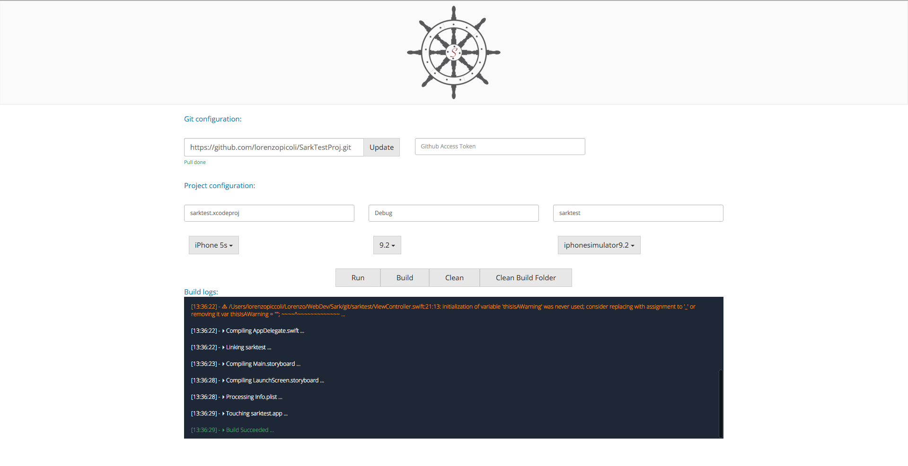

+++
title = "Sark: build and run Xcode projects from anywhere"
date = "2016-02-11T18:24:52-05:00"
author = "Lorenzo Piccoli Módolo"
draft = false
+++

Sark is effectively a lightweight GitHub Actions, but instead of running your actions in the cloud, you can host the server yourself on any Mac device. Sark will then help you build an Xcode project on your Mac from any OS without the use of any applications. All you need to do is set up your Mac and open a browser!

I'm very proud of this project as it was the first real project that I built which solved a problem I was facing at the time. Being a young iOS developer, I couldn't afford a MacBook, but I did have an old iMac that I purchased from a family member. I wanted to be able to edit and test my projects from my super old laptop, which couldn't run macOS. Sark was my solution to that.

**Check this project on [Github](https://github.com/lorenzopicoli/sark)**

---

Technologies: Node.js, Websockets, HTML, Xcode CLI

